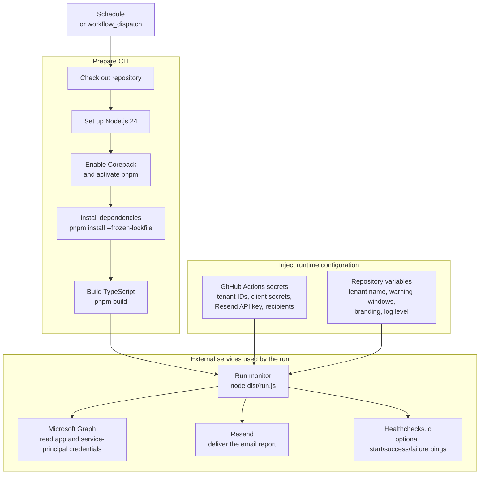

# GitHub Actions Deployment

This project ships an active CI workflow only. For production monitoring, copy a
scheduled workflow like the one below into `.github/workflows/monitor.yml` in
your own deployment repository.

The workflow assumes you store sensitive values as GitHub Actions secrets and
plain configuration as repository variables.

## Workflow Flow

The deployment workflow has two responsibilities: prepare the Node CLI, then run
it with secrets and repository variables injected as environment variables.



## Single-Tenant Workflow

```yaml
name: Entra Credential Monitor

on:
  schedule:
    - cron: "0 15 1 * *"
  workflow_dispatch:
    inputs:
      always_send_report:
        description: "Send report even if no issues are found"
        required: false
        default: false
        type: boolean

concurrency:
  group: entra-credential-monitor
  cancel-in-progress: false

jobs:
  monitor:
    runs-on: ubuntu-latest
    timeout-minutes: 15

    steps:
      - uses: actions/checkout@v7

      - uses: actions/setup-node@v6
        with:
          node-version: 24

      - name: Install dependencies
        run: |
          corepack enable
          corepack prepare pnpm@11.9.0 --activate
          pnpm install --frozen-lockfile

      - name: Build
        run: pnpm build

      - name: Run monitor
        env:
          ENTRA_TENANT_ID: ${{ secrets.ENTRA_TENANT_ID }}
          ENTRA_CLIENT_ID: ${{ secrets.ENTRA_CLIENT_ID }}
          ENTRA_CLIENT_SECRET: ${{ secrets.ENTRA_CLIENT_SECRET }}
          ENTRA_TENANT_NAME: ${{ vars.ENTRA_TENANT_NAME }}
          RESEND_API_KEY: ${{ secrets.RESEND_API_KEY }}
          SENDER_EMAIL: ${{ vars.SENDER_EMAIL }}
          EMAIL_RECIPIENTS: ${{ secrets.EMAIL_RECIPIENTS }}
          WARNING_DAYS: ${{ vars.WARNING_DAYS || '30' }}
          SELF_MONITORING_WARNING_DAYS: ${{ vars.SELF_MONITORING_WARNING_DAYS || '60' }}
          EXPIRED_GRACE_DAYS: ${{ vars.EXPIRED_GRACE_DAYS || '90' }}
          REPORT_TIMEZONE: ${{ vars.REPORT_TIMEZONE || 'America/New_York' }}
          REPORT_BRAND_NAME: ${{ vars.REPORT_BRAND_NAME || 'Peculiar Cloud' }}
          REPORT_BRAND_URL: ${{ vars.REPORT_BRAND_URL || 'https://peculiar.cloud' }}
          LOG_LEVEL: ${{ vars.LOG_LEVEL || 'info' }}
          ALWAYS_SEND_REPORT: ${{ inputs.always_send_report || 'false' }}
          HEALTHCHECKS_PING_URL: ${{ secrets.HEALTHCHECKS_PING_URL }}
        run: node dist/run.js
```

## Multi-Tenant Workflow

For multi-tenant runs, store the complete JSON array in one secret:

```yaml
env:
  ENTRA_TENANTS: ${{ secrets.ENTRA_TENANTS }}
```

The secret value should look like:

```json
[
  {
    "tenantId": "00000000-0000-0000-0000-000000000000",
    "clientId": "11111111-1111-1111-1111-111111111111",
    "clientSecret": "client-secret-value",
    "name": "Example Tenant"
  }
]
```

When `ENTRA_TENANTS` is set, it takes precedence over the single-tenant
`ENTRA_TENANT_ID`, `ENTRA_CLIENT_ID`, and `ENTRA_CLIENT_SECRET` variables.

## Notes

- Do not commit real `.env` files to the repository.
- Keep report recipients in secrets if they identify private teams or clients.
- Use separate Healthchecks.io checks for separate scheduled jobs if you split
  tenants across a matrix.
- GitHub cron schedules are UTC.
